# Discord Bot with Music Player and Statistics

This Discord bot includes role management, moderation, polls, and a YouTube music player.

## Architecture Flowchart

```mermaid
flowchart TD
    %% External Services
    subgraph "External Services"
        direction TB
        DiscordGateway["Discord Gateway"]:::external
        YouTube((YouTube API)):::external
        MongoDB[(MongoDB)]:::data
        Redis[(Redis)]:::data
        FFmpeg{FFmpeg Binary}:::external
    end

    %% Bot Application
    subgraph "Discord Bot Application"
        direction TB
        Main["main.py\n(Entry Point & Plugin Loader)"]:::core

        subgraph "Plugins (Cogs)"
            direction TB
            Automod["Automod Cog"]:::cogs
            Greetings["Greetings Cog"]:::cogs
            HelpCog["Help Cog"]:::cogs
            Moderation["Moderation Cog"]:::cogs
            Music["Music Cog"]:::cogs
            Polls["Polls Cog"]:::cogs
            Role["Role Management Cog"]:::cogs
            Statistics["Statistics Cog"]:::cogs
        end

        subgraph "Utilities & Config"
            direction TB
            Database["Database Utility"]:::utils
            FFCheck["FFmpeg Checker"]:::utils
            ConfigInit["config/__init__.py"]:::utils
            LoggingConfig["logging_config.py"]:::utils
        end

        Logs["logs/\n(Log Files)"]:::logs
    end

    %% Data Flows
    DiscordGateway -->|"events"| Main
    Main -->|"commands & responses"| DiscordGateway

    Main -->|loads| Automod
    Main -->|loads| Greetings
    Main -->|loads| HelpCog
    Main -->|loads| Moderation
    Main -->|loads| Music
    Main -->|loads| Polls
    Main -->|loads| Role
    Main -->|loads| Statistics

    %% Cogs to Utilities & Data
    Automod -->|queries rules| Database
    Moderation -->|updates configs| Database
    Role -->|role data| Database
    Polls -->|vote counts| Redis
    Statistics -->|stats read/write| MongoDB
    Statistics -->|cache metrics| Redis
    Music -->|stream URL| YouTube
    Music -->|health check| FFCheck
    Music -->|audio processing| FFmpeg
    Music -->|"voice stream"| DiscordGateway

    %% Utils to Data
    Database --> MongoDB
    Database --> Redis

    %% Logging
    Automod -->|logs| LoggingConfig
    Greetings -->|logs| LoggingConfig
    HelpCog -->|logs| LoggingConfig
    Moderation -->|logs| LoggingConfig
    Music -->|logs| LoggingConfig
    Polls -->|logs| LoggingConfig
    Role -->|logs| LoggingConfig
    Statistics -->|logs| LoggingConfig
    LoggingConfig --> Logs

    %% Styles
    classDef core fill:#f2f2f2,stroke:#000,stroke-width:1px;
    classDef cogs fill:#d4edda,stroke:#000,stroke-width:1px;
    classDef data fill:#cfe2ff,stroke:#000,stroke-width:1px;
    classDef external fill:#ffe5b4,stroke:#000,stroke-width:1px;
    classDef utils fill:#e2e3e5,stroke:#000,stroke-width:1px;
    classDef logs fill:#fff3cd,stroke:#000,stroke-width:1px;

    %% Click Events
    click Main "https://github.com/pewpenguin/bot/blob/main/main.py"
    click Automod "https://github.com/pewpenguin/bot/blob/main/cogs/automod.py"
    click Greetings "https://github.com/pewpenguin/bot/blob/main/cogs/greetings.py"
    click HelpCog "https://github.com/pewpenguin/bot/blob/main/cogs/help.py"
    click Moderation "https://github.com/pewpenguin/bot/blob/main/cogs/moderation.py"
    click Music "https://github.com/pewpenguin/bot/blob/main/cogs/music.py"
    click Polls "https://github.com/pewpenguin/bot/blob/main/cogs/polls.py"
    click Role "https://github.com/pewpenguin/bot/blob/main/cogs/role.py"
    click Statistics "https://github.com/pewpenguin/bot/blob/main/cogs/statistics.py"
    click Database "https://github.com/pewpenguin/bot/blob/main/utils/database.py"
    click FFCheck "https://github.com/pewpenguin/bot/blob/main/utils/ffmpeg_check.py"
    click LoggingConfig "https://github.com/pewpenguin/bot/blob/main/config/logging_config.py"
    click ConfigInit "https://github.com/pewpenguin/bot/blob/main/config/__init__.py"
    click Logs "https://github.com/pewpenguin/bot/tree/main/logs/"

```



## Features

### Server Statistics
- Track member count changes over time
- Monitor message activity by channel, hour, and day
- Track command usage frequency
- Monitor voice channel activity
- View statistics with interactive commands

### Music Player
- Play music from YouTube
- Queue system for multiple songs
- Volume control
- Skip, pause, and resume functionality
- Display current song information

### Moderation
- Mute/unmute users
- Clear messages
- Temporary ban

### Role Management
- Reaction roles

### Polls
- Create polls with reactions

### Auto-Moderation
- Automatic detection and action for spam, excessive mentions, and banned words/phrases
- Basic raid protection (detects rapid joins)
- Configurable thresholds and actions (warn, delete, mute, kick, ban) for each rule
- Option to set a dedicated log channel for auto-moderation actions

## Setup

### Prerequisites
- Python 3.8 or higher
- FFmpeg installed on your system
- Discord Bot Token
- MongoDB and Redis databases

### Installation

1. Clone this repository or download the source code:
```
git clone https://github.com/Pewpenguin/Bot
cd discord-bot
```

2. Create a virtual environment (recommended):
```
# Windows
python -m venv venv
venv\Scripts\activate

# macOS/Linux
python3 -m venv venv
source venv/bin/activate
```

3. Install the required dependencies:
```
pip install -r requirements.txt
```

4. Install FFmpeg:

   **Windows:**
   - Download FFmpeg from [ffmpeg.org](https://ffmpeg.org/download.html)
   - Extract the files to a folder (e.g., `C:\ffmpeg`)
   - Add the bin folder to your PATH environment variable:
     - Right-click on 'This PC' > Properties > Advanced system settings > Environment Variables
     - Edit the PATH variable and add the path to the bin folder (e.g., `C:\ffmpeg\bin`)
   - Verify installation by running `ffmpeg -version` in a new command prompt

   **macOS:**
   - Using Homebrew: `brew install ffmpeg`
   - Verify installation: `ffmpeg -version`

   **Linux (Ubuntu/Debian):**
   - `sudo apt update && sudo apt install ffmpeg`
   - Verify installation: `ffmpeg -version`

5. Set up your Discord Bot:
   - Go to [Discord Developer Portal](https://discord.com/developers/applications)
   - Create a new application and add a bot to it
   - Enable necessary Intents (Server Members, Message Content, etc.)
   - Copy your bot token
   - Create a `config.py` file in the config directory with the following content:
     ```python
     BOT_TOKEN = 'your_bot_token_here'
     ```

6. Run the bot:
```
python main.py
```

## Music Commands

- `!join` - Join your voice channel
- `!play [song name or URL]` - Play a song from YouTube
- `!pause` - Pause the current song
- `!resume` - Resume the paused song
- `!skip` - Skip the current song
- `!queue` - Show the current queue (up to 5 songs)
- `!now_playing` - Show information about the current song
- `!volume [1-100]` - Change the volume
- `!stop` - Stop playing and clear the queue
- `!leave` - Disconnect from the voice channel

## Statistics Commands

- `!stats` - Shows a general overview of server statistics
- `!stats messages` - Displays detailed message statistics
- `!stats commands` - Shows command usage statistics
- `!stats members` - Displays member count statistics
- `!stats voice` - Shows voice channel usage statistics
- `!stats reset` - Resets all statistics (Admin only)

## Auto-Moderation Commands

These commands require Administrator permissions.

- `!automod` - Shows help for AutoMod commands.
- `!automod toggle <true/false>` - Enable or disable AutoMod for the server.
- `!automod config` - View the current AutoMod configuration.
- `!automod logchannel [#channel]` - Set the channel for AutoMod logs. Provide no channel to disable.
- `!automod addbannedword [word/phrase]` - Add a word/phrase to the banned list.
- `!automod removebannedword [word/phrase]` - Remove a word/phrase from the banned list.
- `!automod setspam <count> <seconds> <action>` - Configure spam detection (e.g., `!automod setspam 5 10 warn`). Actions: `warn`, `delete`, `mute`.
- `!automod setmention <count> <seconds> <action>` - Configure excessive mention detection. Actions: `warn`, `delete`, `mute`.
- `!automod setraid <joins> <seconds> <action>` - Configure raid protection. Actions: `kick`, `ban`, `warn`.

## Note

Make sure your Discord bot has the necessary permissions to join voice channels and send messages.